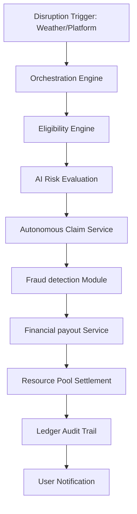

# 🚀 Carbon - Autonomous AI Backend for Worker Pooled Insurance

Carbon is a production-grade, event-driven financial insurance backend designed for modern gig-worker ecosystems (Delivery partners, Ride-share drivers, and Freelancers). It automates the entire micro-insurance lifecycle—from real-time disruption detection to idempotent, zero-human-intervention payouts.

---

## 🏗️ System Architecture & Industrial Context

### The Problem: Vulnerable Gig Worker Ecosystems
Traditional insurance models fail gig workers because:
1.  **High Friction**: Claim processing takes days; workers need cash in minutes.
2.  **Manual Verification**: Human auditing of weather or platform disruptions is slow and expensive.
3.  **Flat Pricing**: Premiums don't adjust to dynamic environmental or behavioral risks.

### The Solution: Carbon's Autonomous Orchestration
Carbon solves this using a **Centralized Orchestration Engine** (`OrchestrationEngine`) that monitors external disruptions and triggers a chain of events across 13 specialized microservices.



---

## 🔒 Authentication & Global Request Standards

Carbon uses **JWT-based Bearer Authentication**. All protected endpoints require an `Authorization` header.

| Header | Description |
| :--- | :--- |
| `Authorization` | `Bearer <access_token>` |
| `Content-Type` | `application/json` |

---

## 📮 API Reference (Full 44 Endpoints)

### 1. 🔑 AUTH Service
Handles identity management, OTP-based registration, and session security.

#### `POST /api/v1/auth/login`
Authenticates a user and returns a token pair.
-   **Method**: `POST`
-   **Body (Raw JSON)**:
    ```json
    {
      "login": "9988776655",
      "secret": "carbon_pass123"
    }
    ```
-   **Response**:
    ```json
    {
      "status": "success",
      "data": {
        "access_token": "eyJhbG...",
        "refresh_token": "eyJhbG...",
        "user_id": "8031e51b-741a-4d43-8f0a-172183c5d799"
      }
    }
    ```

#### `POST /api/v1/auth/logout`
Invalidates the current session.
-   **Method**: `POST`
-   **Response**:
    ```json
    { "status": "success", "data": { "message": "Logged out successfully" } }
    ```

#### `POST /api/v1/auth/otp/send`
Generates and sends a 6-digit OTP to the provided phone number.
-   **Body (Raw JSON)**:
    ```json
    { "phone_number": "9988776655" }
    ```

#### `POST /api/v1/auth/otp/verify`
Verifies the OTP and issues a temporary verification token.
-   **Body (Raw JSON)**:
    ```json
    { "phone": "9988776655", "otp": "123456" }
    ```

#### `POST /api/v1/auth/refresh`
Exchanges a valid refresh token for a new access token.
-   **Body (Raw JSON)**:
    ```json
    { "refresh_token": "eyJhbG..." }
    ```

#### `GET /api/v1/auth/validate`
Checks token validity and returns the associated `user_id`.
-   **Query Parms**: `access_token`

---

### 2. 👤 WORKER Service
Manages worker profiles, geographic zones, and real-time status tracking.

#### `POST /api/v1/workers/profile`
Creates or updates the core worker profile. This is the source of truth for "Zone-based" targeting.
-   **Body (Raw JSON)**:
    ```json
    {
      "user_id": "8031e51b-741a-4d43-8f0a-172183c5d799",
      "name": "Arjun Sharma",
      "phone": "9988776655",
      "zone": "MR-1 (Central Bangalore)"
    }
    ```

#### `GET /api/v1/workers/{id}`
Retrieves demographic and income data.
-   **Response**:
    ```json
    {
      "status": "success",
      "data": {
        "user_id": "...",
        "name": "...",
        "zone": "...",
        "weekly_income": 1200.0
      }
    }
    ```

#### `GET /api/v1/workers/status/{id}`
Live eligibility check. Used by the mobile app to show "Coverage Active" status.
-   **Response**:
    ```json
    { "status": "success", "data": { "is_active": true, "eligible_for_claim": true } }
    ```

---

### 🧠 3. RISK Service
AI-powered behavioral and environmental risk assessment.

#### `POST /api/v1/risk/evaluate`
Runs a predictive model on worker activity (GPS, time on road) to determine current risk tier.
-   **Body (Raw JSON)**:
    ```json
    {
      "user_id": "...",
      "location": "12.97, 77.59",
      "activity_data": { "avg_speed": 45, "hours_active": 12 }
    }
    ```

#### `GET /api/v1/risk/drift`
Monitors the performance of the AI Risk model (KS test, PSI) to detect model degradation.

#### `POST /api/v1/risk/feedback`
Captures "Ground Truth" data (e.g., actual worker accident reports) to retrain models.

#### `GET /api/v1/risk/health`
Status check for the underlying ML inference engine (e.g., Ray Serve or TorchServe).

---

### 💸 4. PRICING Service
Dynamic actuarial pricing based on zone risk and behavioral data.

#### `POST /api/v1/pricing/calculate`
Generates a dynamic premium quote.
-   **Body (Raw JSON)**:
    ```json
    {
      "user_id": "8031e51b-741a-4d43-8f0a-172183c5d799",
      "weekly_income": 1500.0,
      "risk_zone": "MR-1"
    }
    ```
-   **Response**:
    ```json
    {
      "status": "success",
      "data": {
        "premium": 250.0,
        "breakdown": { "base": 150, "zone_surcharge": 50, "risk_adjustment": 50 }
      }
    }
    ```

#### `POST /api/v1/pricing/recalculate`
Triggered by the orchestrator when significant risk drift is detected (e.g., peak monsoon season).

---

### 🛡️ 5. POLICY Service
Tokenized policy issuance and lifecycle management.

#### `POST /api/v1/policy/create`
Issues a digital policy. Once created, the worker is "eligible" for autonomous payouts.
-   **Body (Raw JSON)**:
    ```json
    {
      "user_id": "8031e51b-741a-4d43-8f0a-172183c5d799",
      "premium": 250.0,
      "plan": "Carbon Gold"
    }
    ```

#### `GET /api/v1/policy/{user_id}`
Returns policy status, last coverage window, and premium standing.

#### `POST /api/v1/policy/validate`
Internal endpoint to check if a policy is active *specifically at the moment of a disruption*.

#### `POST /api/v1/policy/cancel/{user_id}`
Terminates coverage and calculates pro-rata premium returns.

---

### 🌩️ 6. TRIGGER Service
External disruption ingestion (The "Ear" of the system).

#### `POST /api/v1/trigger/mock`
**INDUSTRIAL SIMULATION**: Manually injects a disaster into the orchestrator for testing.
-   **Body (Raw JSON)**:
    ```json
    {
      "event_type": "RAIN",
      "duration": "4h (Heavy Disruption)"
    }
    ```

#### `POST /api/v1/trigger/weather`
Ingests raw data from environmental APIs (e.g., OpenWeather) and converts it to actionable disruption events.

#### `GET /api/v1/trigger/active`
Lists all ongoing disasters currently being monitored by Carbon.

#### `POST /api/v1/trigger/stop`
Gracefully terminates a disruption event (e.g., "Rain has stopped"). This shuts down the autonomous payout window.

---

### 📄 7. CLAIM Service
The heart of autonomous settlement. No human input is required here.

#### `POST /api/v1/claims/auto`
The orchestrator calls this to generate mass-claims for an entire zone.
-   **Body (Raw JSON)**:
    ```json
    { "event_id": "EVT-2024-001" }
    ```
-   **Response**:
    ```json
    { "status": "success", "data": { "claims_created": 154 } }
    ```

#### `GET /api/v1/claims/{user_id}`
Lists user-specific claims and their settlement status.

#### `GET /api/v1/claims/history/{user_id}`
Returns aggregated claim statistics (Total payouts vs. premiums paid).

---

### 🚨 8. FRAUD Service
Real-time integrity protection for the resource pool.

#### `POST /api/v1/fraud/check`
Analyzes GPS history and app telemetry to detect "Static Location Spoofing" during disasters.
-   **Body (Raw JSON)**:
    ```json
    { "claim_id": "CLM-9988-ABC" }
    ```
-   **Response**:
    ```json
    {
      "status": "success",
      "data": { "fraud_score": 0.05, "decision": "APPROVED" }
    }
    ```

#### `GET /api/v1/fraud/score/{user_id}`
Returns a rolling fraud-risk profile for the worker. Frequent spoofing attempts lead to permanent policy blacklisting.

---

### 💰 9. PAYOUT Service
Automated financial settlement via UPI/Bank APIs.

#### `GET /api/v1/payout/{user_id}`
Historical view of all settlements credited to the worker.

#### `POST /api/v1/payout/process`
Triggered by the orchestrator upon approval of both Fraud & AI Risk services.
-   **Body (Raw JSON)**:
    ```json
    { "claim_id": "CLM-9988-ABC" }
    ```

#### `POST /api/v1/payout/retry`
Manual/Automated retry mechanism for failed financial transactions (e.g., bank server down).

---

### 📖 10. LEDGER Service
Triple-entry accounting for pool transparency and regulatory audits.

#### `GET /api/v1/ledger/{user_id}`
Returns every premium credit and payout debit for a specific worker.

#### `POST /api/v1/ledger/entry`
Used for non-automated entries like "Pool Contribution from Sponsor".
-   **Body (Raw JSON)**:
    ```json
    {
      "transaction_data": {
        "type": "CONTRIBUTION",
        "amount": 50000.0,
        "source": "Government Grant"
      }
    }
    ```

#### `GET /api/v1/ledger/audit`
Returns the global audit trail. Essential for "Solvency Verification".

---

### 🔔 11. NOTIFICATION Service
Real-time communication via SMS, In-App, and WhatsApp.

#### `GET /api/v1/notify/{user_id}`
Lists the notification history (e.g., "Premium Due", "Payout Successful").

#### `POST /api/v1/notify/send`
Dispatches a custom message to a worker.
-   **Body (Raw JSON)**:
    ```json
    {
      "user_id": "...",
      "message": "Heavy Rain detected in MR-1. Coverage is now ACTIVE."
    }
    ```

#### `POST /api/v1/notify/retry`
Retransmits failed messages via alternative channels (e.g., fallback from app-push to SMS).

---

### 📊 12. ANALYTICS Service
Executive dashboard for monitoring ecosystem health.

#### `GET /api/v1/analytics/dashboard`
Returns high-level KPIs: Total workers covered, active disruptions, and financial burn rate.

#### `GET /api/v1/analytics/timeseries`
Provides 24-hour and 7-day trend data for claim volumes.

#### `GET /api/v1/analytics/zones`
Geospatial heatmap of risk and payout distribution across the city.

---

### 🌊 13. POOL Service
Liquidity management for the decentralized/pooled worker fund.

#### `GET /api/v1/pool/status`
Real-time view of total available capital vs. pending liabilities.

#### `GET /api/v1/pool/ledger/{user_id}`
Specific view of the pool's interaction with a particular worker (Contributive vs. Extractive ratio).

---

### 🛠️ 14. GENERAL APIs
System health and root diagnostics.

#### `GET /`
Health check endpoint. Returns `{"status": "success", "message": "API Running"}`.

---

## 🔄 The Autonomous Insurance Lifecycle (Step-by-Step)

The beauty of Carbon is its zero-touch automation. Here is how it works under the hood:

1.  **Ingestion**: The `trigger_service` polls external weather sensors.
2.  **Detection**: If precipitation > 15mm/hr is detected in "MR-1", a `WEATHER_DISRUPTION` event is created.
3.  **Orchestration**: The `OrchestrationEngine` starts a background task.
4.  **Identification**: It queries the `Worker` service for all workers currently active in "MR-1".
5.  **Eligibility**: The `EligibilityService` verifies which identified workers have an ACTIVE `Policy`.
6.  **Mass-Claims**: A `Claim` is generated for every eligible worker at a fixed "Disruption Payout" rate ($500).
7.  **Fraud Check**: The `FraudService` cross-verifies worker GPS pings during the rain period.
8.  **Settlement**: Upon approval, the `PayoutService` triggers a settlement and the `Ledger` records a `DEBIT` from the `Pool`.
9.  **Notification**: The worker receives a "Disruption Payout Processed" SMS immediately.

---

## 🤖 Autonomous Orchestration Deep-Dive

Carbon's defining feature is its **zero-touch automation**. The system is designed to run continuously in the background, making financial decisions without human intervention.

### 1. The Autonomous "Ear" (`background_monitor`)
Located in `app/services/orchestration_service.py`, the `background_monitor` is a resilient polling task that:
- **Polls Every 60s**: Checks for real-time weather and platform disruptions.
- **Exponential Backoff**: If external APIs or the database fail, the monitor gracefully slows down retries (5s -> 10s -> 20s...) until the system stabilizes.
- **Stateless Recovery**: If the server restarts, the monitor immediately resumes tracking from the last logged event.

### 2. Startup Lifecycle
The automation engine is initialized immediately upon application startup. In `app/main.py`:
```python
@app.on_event("startup")
def on_startup():
    # Initializes DB tables & Event Logs
    init_db() 
    # Spawns the autonomous engine as a decoupled background task
    asyncio.create_task(OrchestrationEngine.background_monitor())
```

### 3. Traceability & Integrity
Every decision made by the AI is logged for audit:
- **EventLog**: Tracks every cycle from `STARTED` to `COMPLETED`.
- **Idempotency**: Payouts are tied to unique `claim_id` and `event_id` combinations, ensuring no worker is ever paid twice for the same disruption.

---

## 🚀 Setup, Environment & Deployment

### Manual Installation
1.  **Clone & Install**:
    ```bash
    git clone https://github.com/carbon-insurance/backend.git
    cd backend
    pip install -r requirements.txt
    ```
2.  **Environment Setup** (`.env`):
    ```ini
    DATABASE_URL=sqlite:///./carbon.db
    SECRET_KEY=your_production_secret
    DEBUG=True
    ```
3.  **Bootstrap DB**:
    ```bash
    # This creates tables and seeds demo workers/pools
    python app/main.py --init-db 
    ```

### Production Deployment (Docker)
```bash
docker build -t carbon-backend .
docker run -p 80:80 --env-file .env carbon-backend
```

---

## ⚠️ Error Handling & Response Patterns

Carbon follows a standardized JSON response pattern for all 44 endpoints.

### Success Pattern (200 OK)
```json
{
  "status": "success",
  "data": { ... }
}
```

### Error Pattern (4xx / 5xx)
```json
{
  "status": "error",
  "message": "Detailed error explanation",
  "data": null
}
```

#### Common Status Codes:
- `401`: Unauthorized (Invalid or missing JWT).
- `403`: Forbidden (User doesn't have permissions for this resource).
- `404`: Not Found (Worker or Claim ID doesn't exist).
- `422`: Unprocessable Entity (Body failed Pydantic validation).
- `500`: System Failure (Internal logic error).
